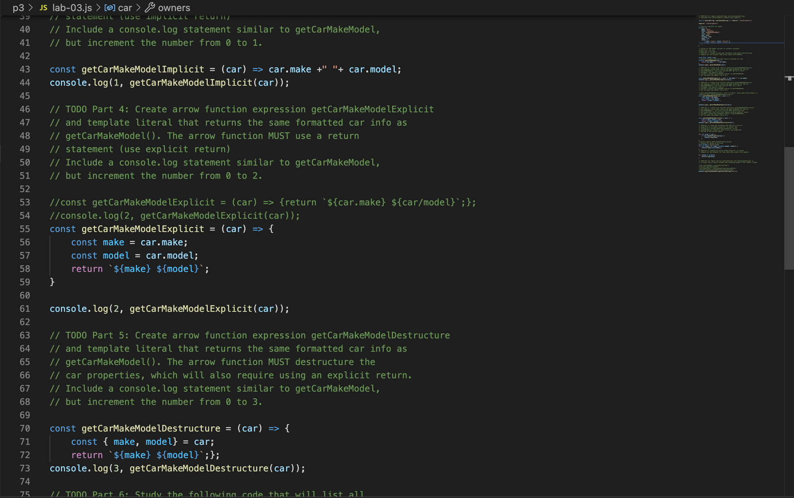

## Welcome to Lab3 

This weeks lab we leanred how to use arrow functions and how to export code onto another js file.
Lab goals and outcomes:

*Practice refactoring JavaScript code to use more modern syntax

*Practice destructuring an object

*Practice converting normal functions into arrow function expressions

*Examine using for..in  syntax with objects

*Practice using for..of syntax with arrays

*Practice creating a Node.js compatible code module using module.exports

*Practice importing a Node.js compatible code module using require

*Examine code using the spread operator

Here is a quick perview of what we worked on for lab3.

